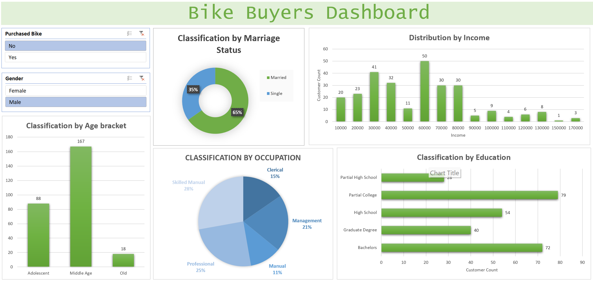

# Bike Buyers Dashboard (Excel)

## Overview
An Excel dashboard analyzing customer data to identify key trends among bike buyers. It highlights purchase behavior across demographics like income, marital status, and region.

## Features
- Interactive filters for demographic variables  
- Visual breakdown of buyers vs. non-buyers  
- Insights into purchasing trends across income groups and regions  

## Tech Stack
- Microsoft Excel (Pivot Tables, Charts, Conditional Formatting, Slicers)

## How to Run
1. Download the Excel file from this repo  
2. Enable editing  
3. Use slicers and filters to explore buyer trends  

## Learning / Takeaways
This project taught me how to transform raw survey data into an interactive tool for understanding customer behavior patterns.

# Dashboard Snapshots

